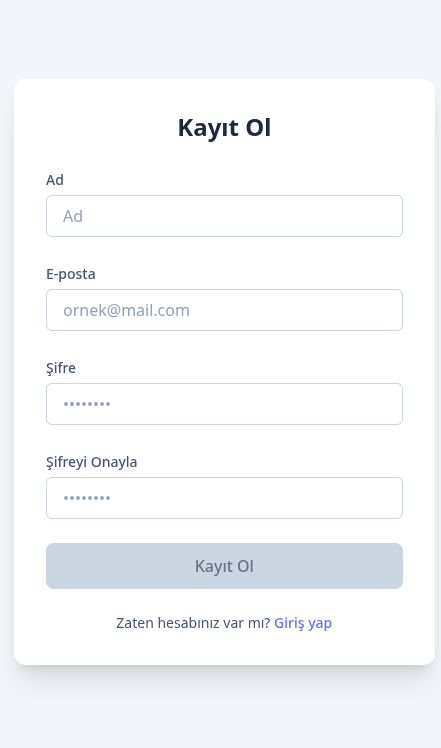
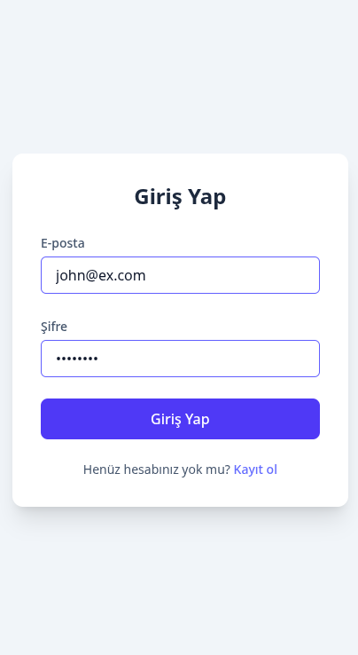
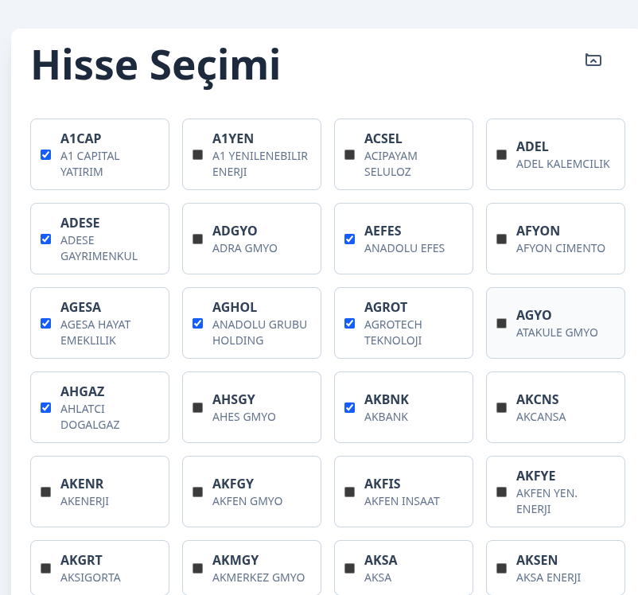
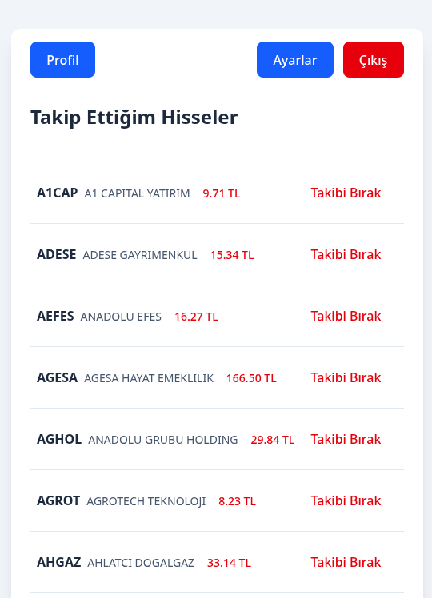
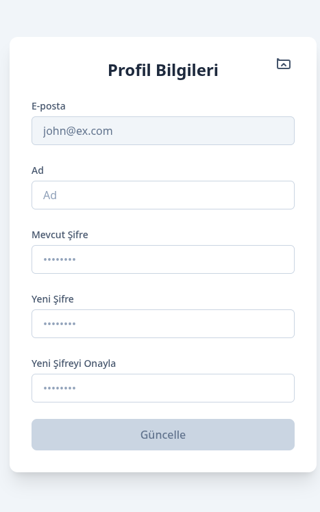

# 📈 Stock Tracker

Minimal, Electron + React tabanlı Türk borsa takip uygulaması.
Gerçek zamanlı fiyatlar, kişisel takip listesi ve kullanıcı yönetimi hepsi tek yerde.

---

## 🚀 Hızlı Başlangıç

```bash
# Depoyu klonla
git clone https://github.com/okanbatuk/stock-tracker.git
cd stock-tracker

# Yarn paket yöneticisini kur
npm i -g yarn || pnpm add -g yarn

# Tüm bağımlılıkları tek seferde yükle
yarn install
cd server && yarn install
cd ../client && yarn install

# Ortam değişkenlerini kopyala
cp backend/.env.example backend/.env

# Uygulamayı ayağa kaldır
yarn run dev          # → hem backend hem Electron açılır
```

---

## 🛠 Teknolojiler

### 🔧 Backend

- **Framework**: Express.js
- **Node Package Manager**: yarn
- **Gerçek Zamanlı Veri**: Socket.io
- **Authentication**: JWT
- **Veri Tabanı**: SQLite (ORM: Sequelize)
- **Veri Kaynağı**:
  - [BigPara Hisse Listesi](https://bigpara.hurriyet.com.tr/api/v1/hisse/list)
  - [BigPara Hisse Detay](https://bigpara.hurriyet.com.tr/api/v1/borsa/hisseyuzeysel/TUPRS)

### 💻 Frontend

- **Framework**: Electron.js + React.ts
- **Node Package Manager**: yarn
- **Tasarım**: TailwindCSS
- **Bildirimler**: Electron Notification, Toastify
- **API İletişimi**: Axios

---

## 🖥️ UI/UX Örnekleri


| Ekran                | Görsel                                  |
| -------------------- | --------------------------------------- |
| **Kayıt**            |    |
| **Giriş**            |          |
| **Hisse Seçim**      |        |
| **Ana Takip Ekranı** |  |
| **Alarm Modal**      |          |
| **Profil**           |      |

---

## 📌 Özellikler

| ✅ Tamamlandı                             | 🚧 Gelecek               |
| ----------------------------------------- | ------------------------ |
| Kullanıcı kayıt & giriş                   | ❌ Fiyat alarmları       |
| Gerçek-zamanlı fiyat güncelleme (polling) | ❌ Performans grafikleri |
| Takip listesi ekle/çıkar                  |                          |
| Bildirim desteği                          |                          |

---

## 🔐 API End-Points (v1)

| Metot  | Endpoint                | Açıklama                   |
| ------ | ----------------------- | -------------------------- |
| `POST` | `/api/v1/auth/register` | Yeni kullanıcı             |
| `POST` | `/api/v1/auth/login`    | Giriş & token al           |
| `POST` | `/api/v1/auth/logout`   | Oturumu kapat              |
| `GET`  | `/api/v1/stocks`        | Tüm hisse senetleri        |
| `GET`  | `/api/v1/stocks/:kod`   | Tekil hisse detayı         |
| `GET`  | `/api/v1/watchlist`     | Kullanıcının takip listesi |
| `POST` | `/api/v1/watchlist`     | Takip listesini güncelle   |

---

## 🧱 Proje Yapısı

```bash
stock-tracker
├── client
│   ├── dist-electron
│   │   └── main.js
│   ├── electron
│   │   └── main.ts
│   ├── eslint.config.js
│   ├── index.html
│   ├── package.json
│   ├── README.md
│   ├── src
│   │   ├── api
│   │   ├── App.css
│   │   ├── App.tsx
│   │   ├── components
│   │   ├── context
│   │   ├── hooks
│   │   ├── index.css
│   │   ├── main.tsx
│   │   ├── pages
│   │   ├── types
│   │   └── vite-env.d.ts
│   ├── tsconfig.app.json
│   ├── tsconfig.electron.json
│   ├── tsconfig.json
│   ├── tsconfig.node.json
│   ├── vite.config.ts
│   └── yarn.lock
├── package.json                        # root workspace
├── README.md
├── server
│   ├── database
│   │   └── data.sqlite
│   ├── package.json
│   ├── src
│   │   ├── config
│   │   ├── modules
│   │   ├── repositories
│   │   ├── scripts
│   │   ├── server.ts
│   │   └── shared
│   ├── tsconfig.json
│   └── yarn.lock
└── yarn.lock
```
